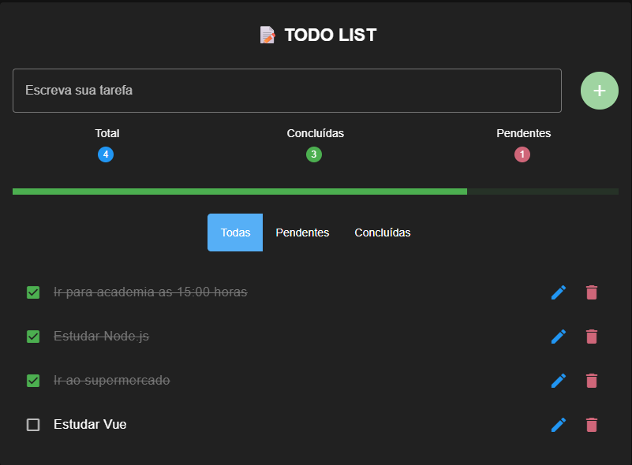
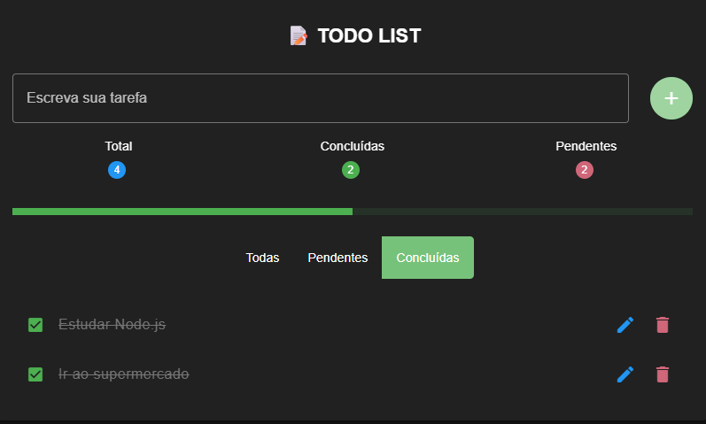
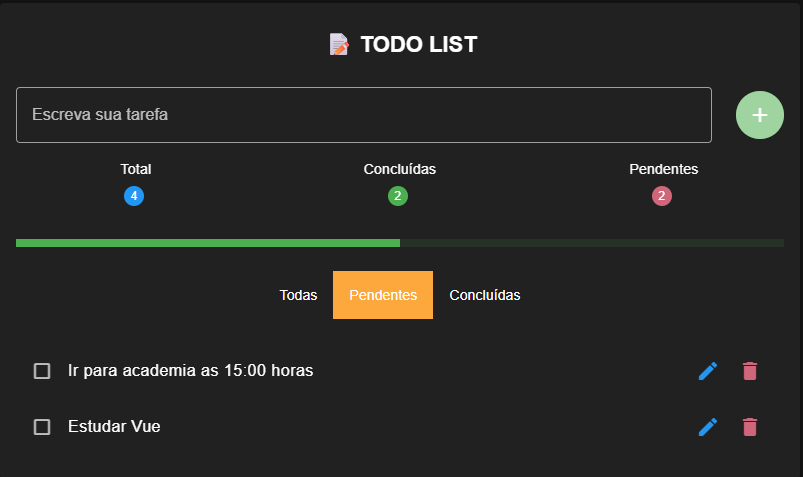

# 📝 Todo List Fullstack

Aplicação completa de gerenciamento de tarefas.

## 🚀 Tecnologias

### Frontend

- Vue 3
- Vuetify

### Backend

- Node.js
- Express

### Banco de dados

- SQL Server

---

## ⚙️ Funcionalidades

- Criar tarefas
- Editar tarefas
- Marcar como concluída
- Deletar tarefa
- Filtros (todas, pendentes, concluídas)
- Barra de progresso

---

## 🖼️ Preview

### Tela principal

### Filtros

---

## 🎯 Objetivo

Projeto desenvolvido para estudo de desenvolvimento **Fullstack**, integrando frontend em Vue com API REST em Node.js.
